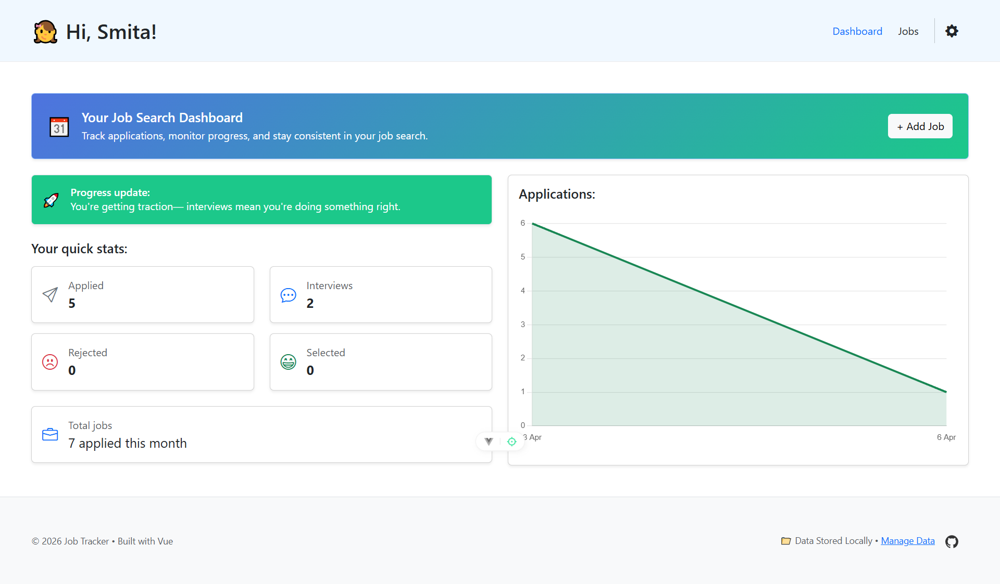
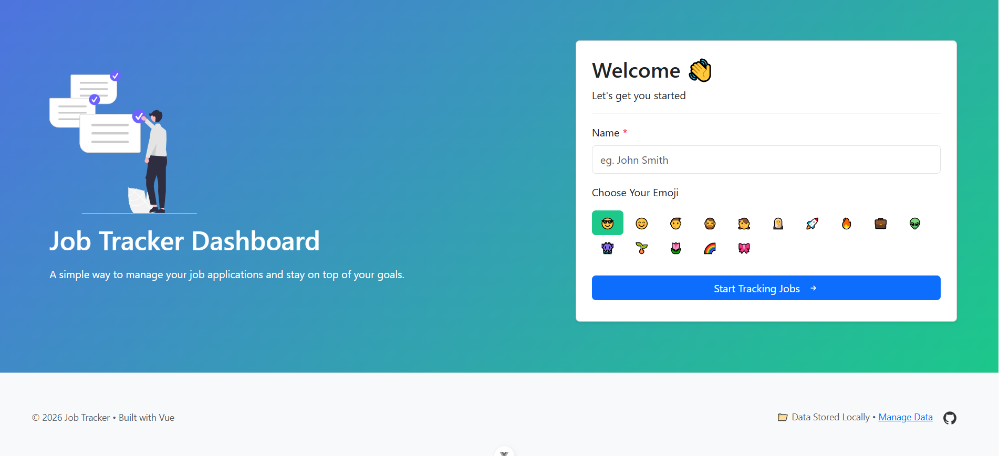
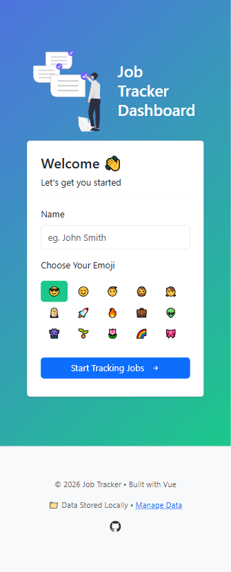

## 🔗 Live Demo

👉 https://smitauix-job-tracker.netlify.app/

# 💼 Job Tracker Dashboard

A clean and intuitive **Job Tracking Web App** built with Vue.js to help you stay organized, track applications, and monitor your job search progress.

---

## ✨ Features

* 📋 **Track Job Applications**
  Add, edit, and manage all your job applications in one place.

* 🔍 **Search & Filter**
  Quickly find jobs using search and filter options.

* 📊 **Insights & Analytics**
  Visualize your application progress with charts (when enough data is available).

* 📝 **Notes Support**
  Add personal notes for each job and view them on demand.

* 📱 **Responsive Design**
  Optimized for both desktop and mobile (cards on mobile, table on desktop).

* 💾 **Local Storage Persistence**
  Your data is stored locally in your browser.

* 📤 **Export Data**
  Export your job data to Excel for backup or sharing.

---

## 🧠 Tech Stack

* ⚡ **Vue.js**
* 📃 **Typescript**
* 🎨 **Bootstrap**
* 📦 **Vue Router**
* 🔥 **Pinia, Composables**
* 📊 **Chart Library**
* 💾 **LocalStorage**

---

## 🚀 Getting Started

### 1. Clone the repo

```bash
git clone https://github.com/smitatarawade/job-tracker.git
cd job-tracker
```

### 2. Install dependencies

```bash
npm install
```

### 3. Run the app

```bash
npm run dev
```

---

## 📱 Mobile Experience

* Card-based layout for better readability
* Expandable notes section
* Optimized spacing and touch-friendly UI

---

## ⚠️ Data Storage Notice

> Your data is stored locally in your browser.
> Clearing browser cache or site data may remove your saved jobs.

👉 It is recommended to **export your data regularly**.

---

## 🛠️ Future Improvements

* 🔐 User authentication (cloud sync)
* ☁️ Backend integration
* 📈 Advanced analytics
* 💻 Import Data
* 🌙 Dark mode
* 🔔 Notifications / reminders

---

## 📸 Screenshots

### Dashboard


### Onboarding


### Mobile View


---

## 🙌 Motivation

This project was built to:

* Practice **Vue.js + UI/UX skills**
* Solve a real-world problem (job tracking)
* Build a **portfolio-ready, production-style app**

---

## 📬 Feedback

If you have suggestions or feedback, feel free to reach out or open an issue!

---

## ⭐ Show your support

If you like this project, give it a ⭐ on GitHub!

---
